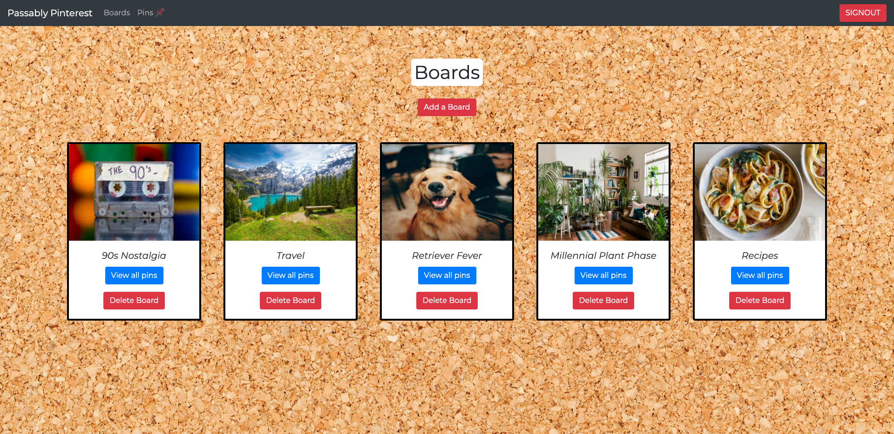
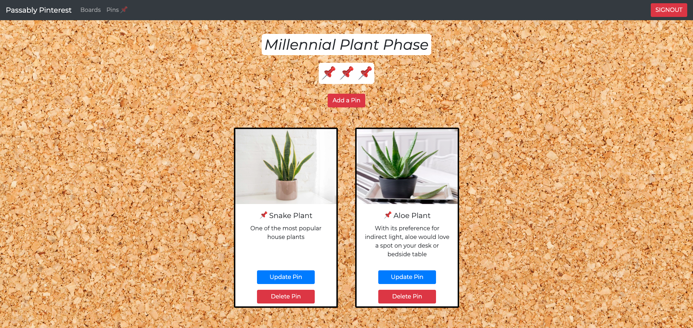
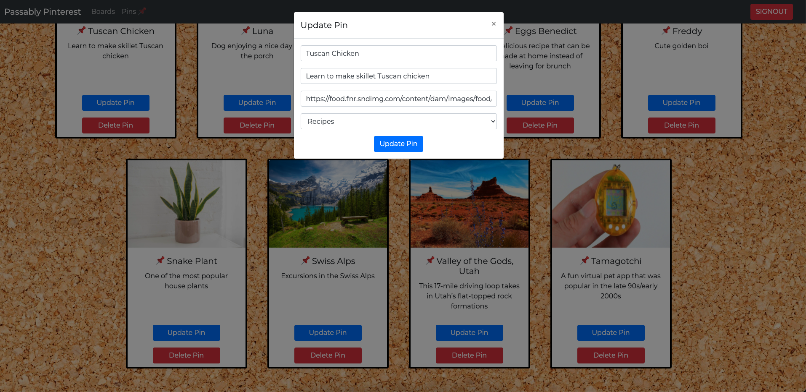

# Passably Pinterest

#### Overview
Passably Pinterest is an app in which users can create boards with associated pins to save images with descriptions of that image on a card. Pins belong to boards. Pins can also be updated. Cards then get posted to a corkboard to show all boards and pins. If the user just wants to see pins associated with that board, the user can click to view only that board and its pins. Have fun pinning!
#### Deployed project
[Passably Pinterest](https://lindseysatterfield-passably-pinterest.netlify.app/) 

#### User description
This is an app for someone who wants to save images and descriptions about an image in an organized manner. The user can treat it like a virtual vision board that will never run out of space! 

#### Project board
https://github.com/lindseysatterfield/ASSIGNMENT-Firebase-Pinterest/projects/1

#### Features
- Full create, read, update, and delete features (CRUD)
- Google log in to save boards and pins specific to that user
- User can create boards and pins
- User can delete boards and pins
- User can update pins
- User can add their own image urls to boards and pins
- Board view in which users only see pins connected to that board category
- All boards view
- All pins view

#### Screenshots

#### Contributors
[Lindsey Satterfield](https://github.com/lindseysatterfield)

#### Video walkthrough
[Loom](https://www.loom.com/share/f3fad4221ce2499aa793c5f49ae4b19c)
